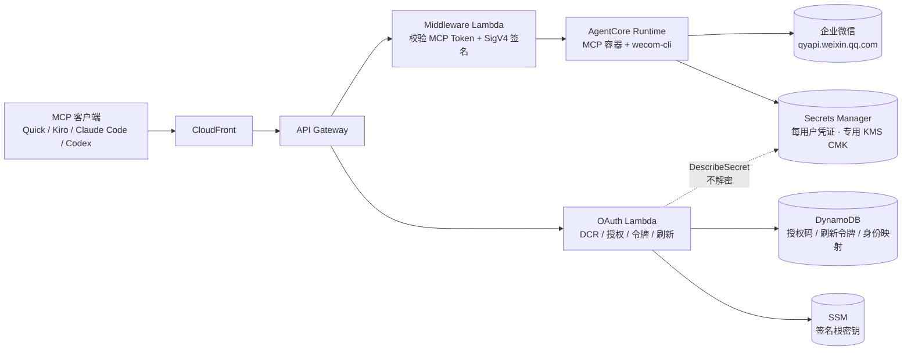

# wecom-mcp-on-agentcore

[](LICENSE)
[](https://www.npmjs.com/package/@wecom/cli)
[](https://aws.amazon.com/bedrock/agentcore/)
[](https://github.com/aws-samples/sample-lark-mcp-on-agentcore)

**在 [@wecom/cli](https://www.npmjs.com/package/@wecom/cli) 之上构建的托管远程 MCP 服务 —— 让支持远程 MCP 的客户端（[Amazon Quick Suite](https://aws.amazon.com/quick/)、[Kiro](https://kiro.dev/)、[Claude Code](https://docs.anthropic.com/en/docs/claude-code)、[Codex](https://openai.com/index/introducing-codex/)）通过 37 个工具操作企业微信的日程、会议、文档、表格、通讯录、待办、微盘与邮件，且每次调用都以「发起者本人」的企业微信身份执行。**

`@wecom/cli` 是企业微信官方命令行工具，把 13 个业务域的能力封装成 94 个方法并内置参数 schema。本项目由容器内的 `wecom-cli` 执行所有 API 调用，继承其全部能力，并补齐它作为**团队服务**时缺的那一层：

- **业务用户零门槛。** 成员在浏览器扫码授权一次即用，不需要本地安装、不需要配置、不需要懂技术。
- **每人一套凭证，按人隔离。** 每位用户的凭证独立加密存储，调用时才物化到内存文件系统，用完即删。
- **IT 侧集中部署。** 一次部署全员共用，服务跑在你自己的 AWS 账号内，凭证不出你的账号。

底座是 AWS Bedrock AgentCore Runtime：空闲缩零、按实际消耗计费。

---


## 为什么需要这一层

企业微信官方提供 MCP url，但它是**按「机器人 + 权限组」签发**的。也就是说：

| | 直接用官方 MCP url | 本项目 |
|---|---|---|
| 调用的执行者 | **机器人**（所有人共用同一个） | 发起者**本人** |
| 审计能追到人吗 | 追不到，日志里只有机器人 | 能，每次调用绑定到具体用户 |
| 可见范围 | 全员共享一个可见范围 —— 要么越权看到别人的，要么看不到自己的 | 由企业微信按每个人的权限收敛 |
| 多人共用 | 一个 token 发给所有人，泄露即全员失守 | 每人独立凭证，独立 KMS 加密 |

**「审计追不到人」和「可见范围串了」这两件事，在多人场景下是硬伤，而它们无法靠配置解决 —— 只能在中间加一层做按人的身份分发。** 这层就是本项目：它把 MCP 客户端的用户身份映射到各自的企业微信身份，替每个人保管自己那份凭证。

一个附带的好处：读取类权限的收敛是**企业微信平台强制**的。你传谁的 userid，就只返回那个人有权访问的内容 —— 隔离性不靠我们的代码兜底，平台侧兜。

---

## 部署


```bash
# ① 安装依赖（一次）
cd infra  && npm install            && cd ..
cd lambda && npm install --omit=dev && cd ..
python3 -m venv .venv && .venv/bin/pip install boto3

# ② CDK bootstrap（每账号每区一次）
cd infra && npx cdk bootstrap && cd ..

# ③ 部署
bash scripts/run-deploy.sh --region <你的区域>
```

前置检查 → SSM 签名根密钥 → CDK 部署 → 构建推送镜像 → AgentCore Runtime → 回填配置

第③步**幂等**，失败可直接重跑，已成功的部分不会重做。结束时打印 MCP 端点：`https://xxxxxxxx.cloudfront.net`

> 逐步命令、每步「看到什么算对」、以及失败处置表见 `docs/deployment_zh.md`。

---

## 连接

部署完成后，在任意支持远程 MCP 的客户端中添加：

```json
{
  "mcpServers": {
    "wecom": {
      "type": "http",
      "url": "https://<你的端点>/mcp"
    }
  }
}
```

保存后按提示在浏览器扫码完成企业微信授权即可。各客户端的差别只在**谁来建这个连接**：

| 客户端 | 需要填什么 | 机制 |
|---|---|---|
| Kiro / Claude Code / Codex | **只有 URL** | 走 MCP OAuth：`401` → RFC 9728 元数据发现 → DCR 自注册 → 浏览器扫码 |
| **Amazon Quick**（云端与 Desktop） | 管理员建一次，使用者**什么都不填** | 同上，Quick 自动完成 DCR。**云端建的连接器会自动出现在 Desktop 里**，两端同一个 Quick 账号。需 **Enterprise** 订阅 |
| Quick Desktop 自己加（可选） | URL + Token | Desktop 的 MCP Servers → Remote 表单只有 `Name / URL / Token / Timeout`，**无 OAuth 流** —— 用 `/authorize/self` 自助页扫码取 token 后粘进去 |

第二行是推荐路径：管理员在 Quick console 建一次 MCP 集成并共享，全员零配置、令牌自动续期。第三行只在管理员没建、或你只想给自己用时才需要。

详见 `docs/connect-mcp-clients_zh.md`。

---

## 架构



请求路径：客户端 → CloudFront → API Gateway → Middleware Lambda（校验 MCP token、用 SigV4 签名后调 Runtime）→ AgentCore Runtime（容器内 `wecom-cli` 调企业微信 API）。授权路径独立：OAuth Lambda 负责 DCR、扫码授权、令牌签发与刷新。

**OAuth Lambda 刻意没有 `GetSecretValue` 权限** —— 它需要判断某人的凭证是否已落库，用 `DescribeSecret` 读标签就够，不必也不该碰凭证内容。

<details>
<summary>组件一览</summary>

| 类别 | 组件 | 说明 |
|---|---|---|
| 计算 | AgentCore Runtime | MCP 服务容器，ARM64，无状态，空闲缩零 |
| 计算 | Lambda × 2 | OAuth 授权服务器 + MCP 数据面中间层 |
| 边缘 | CloudFront + API Gateway | HTTPS 入口 |
| 构建 | CodeBuild（ARM）+ S3 | 远程构建镜像，源码桶 7 天过期；本机是 arm64 时自动跳过 |
| 状态 | Secrets Manager | 每用户凭证，专用 KMS CMK 加密（`RETAIN`） |
| 状态 | DynamoDB × 3 | 授权码、刷新令牌、真实身份 → 凭证槽位映射 |
| 状态 | SSM | 令牌签名根密钥 |
| 可观测 | CloudWatch + SNS | 3 个告警（凭证回写失败 + 两个 Lambda 错误率）→ SNS |

</details>

<details>
<summary>凭证怎么存、怎么用</summary>

1. 用户扫码，容器内 `wecom-cli` 完成授权并生成凭证 blob。
2. 容器立刻读回**真实企业微信身份**（用一个查不到结果的关键词打一次通讯录搜索，负载 56 字节），写进凭证与 Secret 标签。
3. 凭证写入 `Secrets Manager`，路径按用户隔离，专用 CMK 加密。
4. 每次调用时才把凭证物化到**内存文件系统的独立目录**，调用结束即删。
5. 同一个人再次授权时，先探测旧凭证是否还活着 —— 活着就复用同一槽位，不堆孤儿凭证。

第 5 步的存活探测必须真打一次企业微信，不能用「密钥是否存在」代替：**密钥存在不等于机器人存在**（用户删掉机器人后，密钥还在但凭证已死）。

</details>

---

## 令牌与安全

| 机制 | 说明 |
|---|---|
| MCP token | 无状态 HMAC，不落库。签名根密钥在 SSM，五把子密钥按用途域分离 |
| Access token | 30 天。这个值是实测定的 —— Quick 是**反应式续期**（到期后撞到 401 才换，实测延迟约 4 分钟），周期越短用户可见的失败窗口越频繁 |
| Refresh token | 90 天滑动窗口，**每次刷新强制轮换**。DCR 客户端是公开客户端（无 secret），所以拿旧的来换 = 重放 → **吊销整个家族**，不是只拒这一次 |
| 凭证加密 | 每用户一条 Secret，专用 KMS 客户托管密钥，仅本服务可解密 |
| 授权页防钓鱼 | `HttpOnly; Secure; SameSite=Lax` 的流程 cookie 绑定浏览器 + 一次性取过即删 + 300s TTL；页面显式警告只扫自己发起页面上的码 |

详见 `docs/security_zh.md`。

> ⚠️ **对外开放前必须加企业 SSO 前置。** 上述 cookie 绑定防不住「攻击者在自己浏览器发起流程、只把二维码图片转发给受害者」这一种。内部使用可接受，公网开放不行。

---

## 工具列表

工具目录在**构建期**由 `wecom-cli --schema` 自动生成（13 次 service + 94 次 method），不手工建模 —— 这样工具定义与镜像里的 CLI 版本严格绑定，不会漂移。

### Tier 1 高频工具（35 个，直接注册）

| 类别 | 工具 |
|---|---|
| 日历 (5) | 创建日程、日程列表、搜索日程、查忙闲、取消日程 |
| 会议 (4) | 创建会议、会议列表、搜索会议、搜索会议室 |
| 待办 (3) | 创建、列表、完成 |
| 消息 (3) | 发消息、机器人发消息、机器人会话列表 |
| 智能表格 (3) | 新增记录、更新记录、查询记录 |
| 智能文档 (3) | 创建、读取页面、更新块内容 |
| 文档 (3) | 搜索、读取正文、追加正文 |
| 微盘 (3) | 搜索、上传、下载 |
| 表格 (2) | 获取表格、读取区域 |
| 邮件 (2) | 搜索、发送 |
| 会话 (2) | 聊天记录、群列表 |
| 通讯录 (1) | 搜索用户 |
| 媒体 (1) | 上传 |

### Meta 工具（2 个）

| 工具 | 说明 |
|---|---|
| `wecom_discover` | 按关键词搜索其余方法，返回方法名 + 完整参数 schema |
| `wecom_invoke` | 执行 `wecom_discover` 找到的方法 |

Tier 1 常驻约 8K tokens。剩下 59 个方法不占固定 context，按需通过 discover / invoke 调用。

<details>
<summary>94 个方法的业务域分布</summary>

| 业务域 | 方法数 | 业务域 | 方法数 |
|---|---|---|---|
| 智能表格 smartsheet | 26 | 待办 todo | 6 |
| 智能文档 smartpage | 10 | 消息 message | 4 |
| 文档 doc | 9 | 邮件 mail | 3 |
| 会议 meeting | 9 | 会话 chat | 2 |
| 表格 sheet | 8 | 媒体 media | 2 |
| 日历 calendar | 7 | 通讯录 contact | 1 |
| 微盘 disk | 7 | | |

</details>

---

## 能力边界

以下不是「还没做」，是平台行为或架构定位所限。**部署前请让使用者知道第一条。**

- **授权时要绑定一个企业微信「机器人」，而写操作只认机器人所有权。** 扫码后企业微信让你选「新建机器人」或「绑定已有机器人」。首次授权只能新建；之后重新授权**必须选绑定原有那个** —— 选新建会**永久失去**对旧机器人所建对象（文档 / 表格 / 日程）的编辑权限。项目为此做了刷新令牌自动续期（正常情况下根本不需要重新授权）与同一人复用凭证槽位，但**第一次授权那个机器人躲不掉**。

- **读写不对称。** `message.send` 以**授权人本人**身份执行；`message.aibot.send` 才走机器人身份，且受「收件人须先与机器人对话过」限制。创建类写操作正常。

- **智能表格写入在可见范围超 10 人时会失败**（企业微信返回 `851003 no authority`）。多人共用必然超过 10 人，所以这类写入在团队场景下是常态失败，需退回 Webhook 方案。

- **消息只能发给授权人本人或机器人近期往来的会话。** 无群发、无值守推送。

- **需要本地文件路径的方法在远程 MCP 下不可用。** Agent 与容器文件系统隔离，`media.upload`、`disk.files.upload`、智能文档的页面导入等拿不到文件。工具描述里已自动标注「远程 MCP 下不可用」并给出替代路径（例如写智能文档改用 `smartpage.blocks.update` 传内联 mdx）。

- **无 Skill 引擎。** 参考实现把官方 Skill 改写成 MCP 形态按需加载，本项目**尚未实现** —— 当前只有工具，没有多步编排指引。这是已知缺口，不是不做。

完整清单见 `docs/limitations_zh.md`。

---

## 成本

成本几乎全由**用户数**决定，与调用量基本无关：

| 项 | 单价 | 10 人 | 100 人 |
|---|---|---|---|
| Secrets Manager（每用户一条凭证） | $0.40 / 密钥 / 月 | $4 | $40 |
| KMS 客户托管密钥 | $1 / 密钥 / 月（开轮换后稳定态 $3） | $3 | $3 |
| AgentCore Runtime | CPU $0.0895/vCPU·h、内存 $0.00945/GB·h | ~$0.05 | ~$0.5 |
| CloudFront / Lambda / DynamoDB / ECR | 按量 | 几美分 | 几美分 |
| **合计（估）** | | **约 $7 / 月** | **约 $43 / 月** |

AgentCore 几乎不花钱，因为它按**实际消耗**计费 —— 调用的 3-4 秒里绝大部分是等企业微信返回，而 I/O 等待期的 CPU 不计费。

> 以上为列表价推算，非账单。到 200 人以上时 Secrets Manager 的每密钥月费成为绝对主项，那时值得评估改用 DynamoDB + KMS 信封加密存凭证。

---

## 运维

```bash
# 列出已授权用户
node scripts/mint-token.js --list --region <区域>

# 为某用户补发访问令牌（授权页关掉没复制到时用）
node scripts/mint-token.js --user <userId> --region <区域> --out token.txt

# 探测每条凭证是否仍然有效（机器人被删会让凭证失效）
bash scripts/probe-creds.sh <端点> <区域>

# 订阅告警 —— 默认零订阅，CRITICAL 发不出去
aws sns list-topics --region <区域> --query 'Topics[?contains(TopicArn,`WecomMcp`)]'
aws sns subscribe --topic-arn <ARN> --protocol email \
  --notification-endpoint <你的邮箱> --region <区域>
```

部署参数：

```bash
bash scripts/run-deploy.sh --region <区域> --build codebuild  # 强制远程构建
bash scripts/run-deploy.sh --region <区域> --build local      # 强制本机构建（需 arm64）
bash scripts/run-deploy.sh --region <区域> --skip-image       # 只更新 Lambda / 基建
bash scripts/deploy.sh     --region <区域> --app <slug>       # 多实例隔离部署
```

### 卸载

```bash
cd infra && npx cdk destroy
```

以下资源**不会**被一起删除，需单独清理：用户凭证的 KMS CMK（`RETAIN`）、ECR 仓库、AgentCore Runtime 与其执行角色、两个 SSM 参数、Secrets Manager 里的用户凭证。

> ⚠️ SSM 里的 `state-secret` 是所有令牌的签名根密钥。**重建它会让全部已发令牌立即失效**，所有用户需重新授权 —— 且须逐一提醒他们选「绑定已有机器人」，否则集体丢失对旧产物的写权限。

---

## 目录结构

| 目录 | 内容 |
|---|---|
| `docker/` | 容器：MCP 协议实现、`wecom-cli` 调用层、授权流、凭证物化 |
| `lambda/` | OAuth 授权服务器 + MCP 数据面中间层 |
| `infra/` | CDK：API Gateway / CloudFront / Lambda / DynamoDB / KMS / CodeBuild / 告警 |
| `scripts/` | 部署与运维脚本 |
| `schemas/` | 构建期由 `wecom-cli --schema` 生成的 94 个方法定义 + Tier 1 名单 |
| `tools/` | schema 提取与转换（构建期运行） |
| `docs/` | 部署、接入、限制、安全（**不入库**，见下） |

## 文档

**`docs/` 不进本仓库**（已在 `.gitignore` 里），只随交付包分发 —— 用 `scripts/package-delivery.sh` 打包时会带上。所以下面这些文件在仓库里看不到，clone 下来也没有：

| 主题 | 文件 |
|---|---|
| 部署与日常运维（逐步 + 「看到什么算对」+ 失败处置） | `docs/deployment_zh.md` |
| 接入 MCP 客户端（Quick / Kiro / Claude Code / Codex） | `docs/connect-mcp-clients_zh.md` |
| 已知限制与平台行为 | `docs/limitations_zh.md` |
| 安全与数据流 | `docs/security_zh.md` |

## 风险提示

让 AI Agent 以用户身份操作企业微信 API，存在模型幻觉与 prompt injection 等固有风险。本服务的工具返回值里包含平台下发的身份上下文字段，其中带有自然语言指令 —— 这既是提示注入面，也可能让模型对用户隐瞒权限边界。使用前请评估这一风险，并优先在受控范围内试点。

## 贡献

见 [CONTRIBUTING.md](CONTRIBUTING.md)。安全问题请走仓库 Security 页的 **Report a vulnerability**，不要开公开 issue。

## License

本项目基于 **MIT No Attribution (MIT-0)** 授权 —— 见 [LICENSE](LICENSE)。

设计与部分代码移植自 [`aws-samples/sample-lark-mcp-on-agentcore`](https://github.com/aws-samples/sample-lark-mcp-on-agentcore)。
